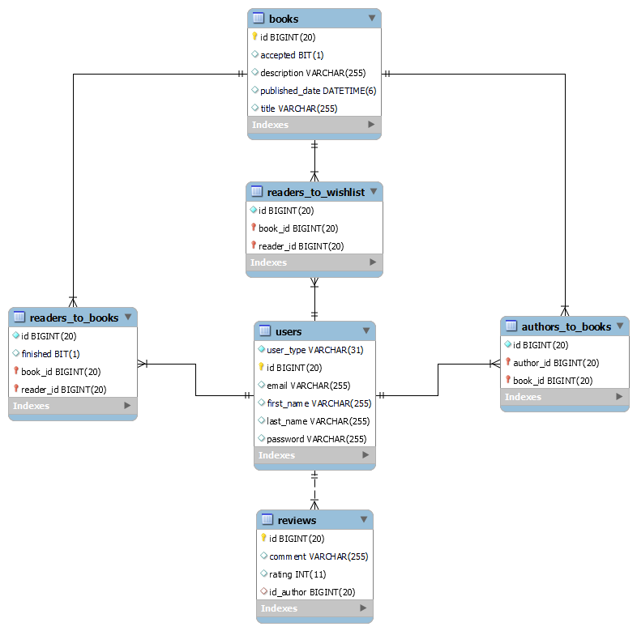

## Great Reads App

<Description here>The purpose of Great Reads is to facilitate a series of functionalities through which users can catalog the books they read, offering reviews and comments.

At the same time, authors can publish books in electronic format, with the possibility of receiving feedback from readers.

A user can be an Administrator, an Author or a Reader. The Administrator can accept or deny the publication of a book, and in the same time, can accept or deny a comment from a user.
The Author can publish multiple books, and a book can be published by multiple authors. For modeling this many-to-many relation between Author and Book, an additional join table is required -> authors_to_books.
The Reader can mark a book as read, and this will add the book in the list of read books. Another many-to-many relation which requires an additional join table, readers_to_books. The same Reader can also add books to his wishlist, which means another many-to-many relation, and another join table, this time readers_to_wishlist. He can also publish a Review, a one-to-many relation for which is needed only the Review entity.

